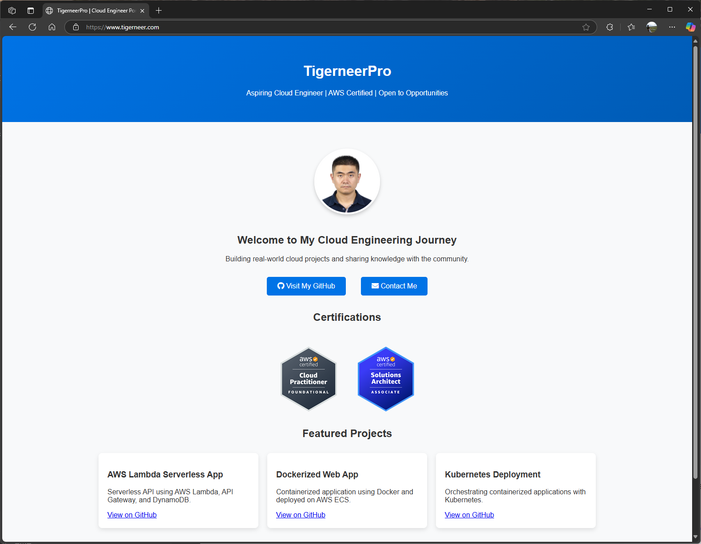
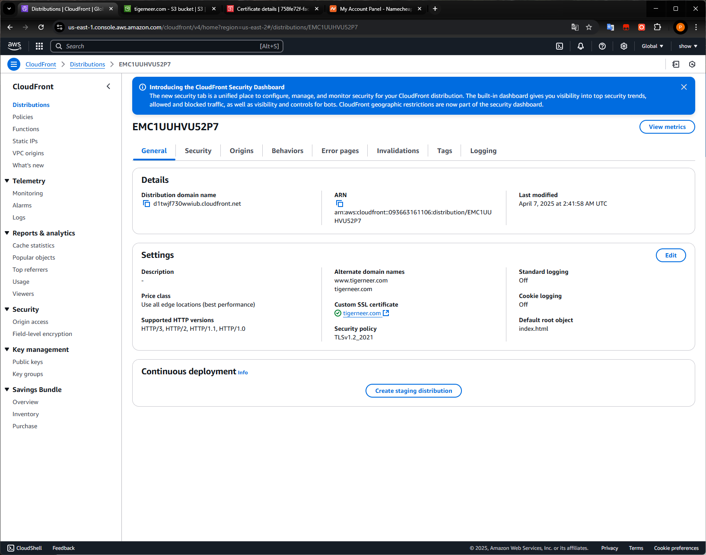
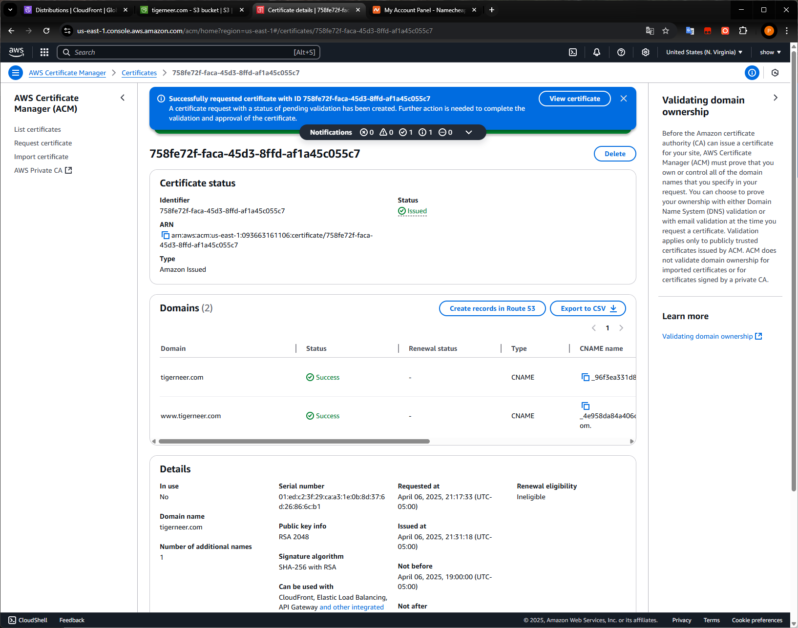
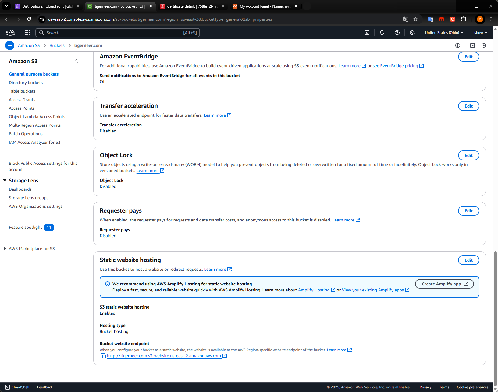
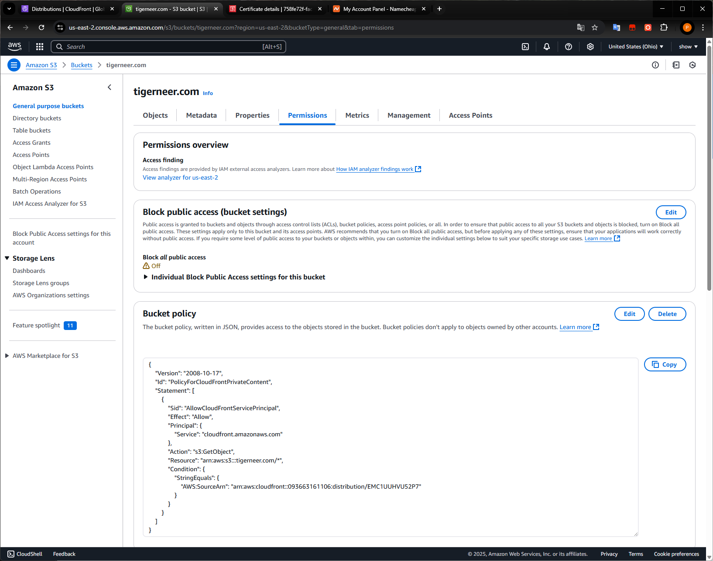
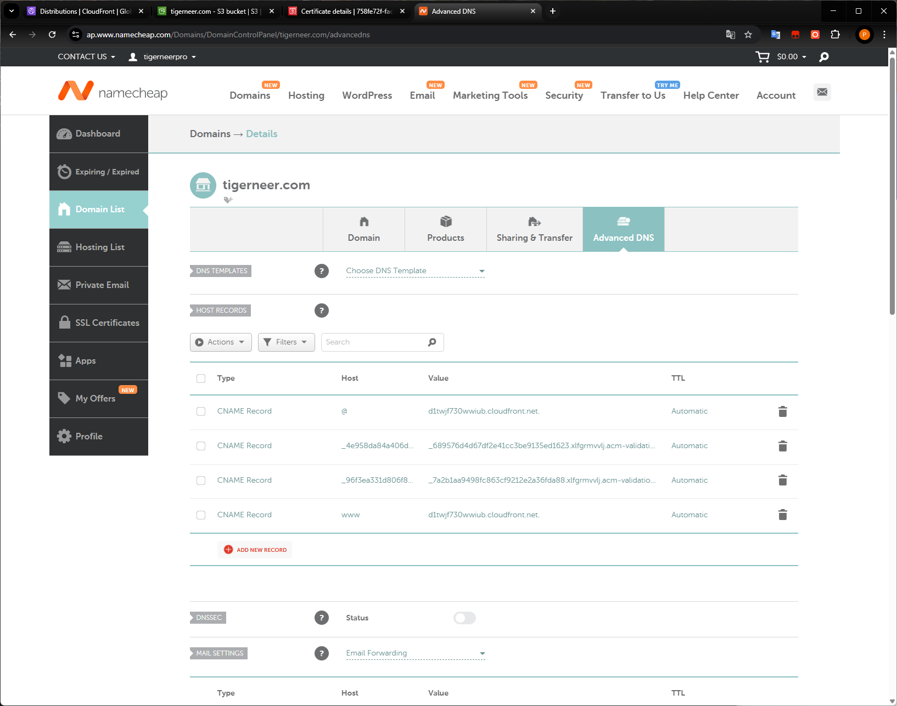

# AWS Static Website Deployment — tigerneer.com

This project demonstrates how to deploy a **fully functional static website** using:
- **Amazon S3** (Static website hosting)
- **Amazon CloudFront** (Global CDN)
- **AWS ACM** (SSL Certificate for HTTPS)
- **Custom Domain** via **Namecheap DNS**

👉 Live site: [https://www.tigerneer.com](https://www.tigerneer.com)

---

## 📸 Screenshots

| Homepage (Live Site) | CloudFront Distribution | SSL Certificate (ACM) |
|----------------------|-------------------------|------------------------|
|  |  |  |

| S3 Static Hosting | S3 Bucket Policy | Namecheap DNS |
|------------------|------------------|---------------|
|  |  |  |

---

## 🧰 Technologies Used

- **Amazon S3** — For static file hosting
- **Amazon CloudFront** — For fast and secure global delivery
- **ACM (AWS Certificate Manager)** — For HTTPS using a free SSL certificate
- **Namecheap** — For domain registration and DNS management

---

## 🚀 Deployment Steps

1. 🗂 Create and upload a static website to **S3**
2. 🔓 Configure bucket policy to allow CloudFront access
3. 🛡 Issue SSL certificate via **ACM** and validate with CNAMEs in Namecheap
4. 🌐 Create **CloudFront distribution** with custom domain and HTTPS
5. 🌍 Point Namecheap DNS to CloudFront (CNAME `@` and `www`)
6. ✅ Test live website and secure HTTPS

---

## 💡 Key Learnings

- Hands-on with AWS services used in real production systems
- End-to-end static site deployment process with HTTPS and domain
- DNS management via external registrar and integration with AWS

---

## 📁 Folder Structure

bash
tigerneer-aws-static-website/
├── README.md
└── screenshots/
    ├── 01-homepage.png
    ├── 02-cloudfront-config.png
    ├── 03-acm-certificate.png
    ├── 04-s3-static-hosting.png
    ├── 05-s3-permissions-policy.png
    └── 06-namecheap-dns-records.png

---

## 🧑‍💻 Author

**Tigerneer**  
Aspiring Cloud Engineer | AWS Certified  
📫 [Visit my GitHub](https://github.com/TigerneerPro)
